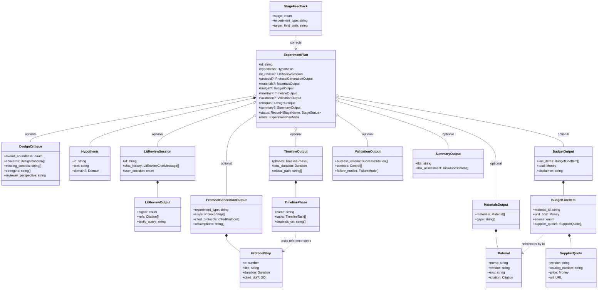

> **Tentative — first-pass data architecture proposal.** Drafted so the team has something concrete to align on. Specifics will likely change as others weigh in.

# Type Reference

Data contracts for the AI Scientist Assistant pipeline. Source of truth for what each stage consumes and emits. Mirrors the TypeScript files in `spec/types/`.

## Contents

1. [Stages at a glance](#stages-at-a-glance)
2. [Type composition diagram](#type-composition-diagram)
3. [Pipeline flow](#pipeline-flow)
4. [Conventions](#conventions)
5. [Shared types](#shared-types)
6. [Stage 1 — Lit Review](#stage-1--lit-review)
7. [Stage 2 — Protocol Generation](#stage-2--protocol-generation)
8. [Stage 3 — Materials & Supply Chain](#stage-3--materials--supply-chain)
9. [Stage 4 — Budget](#stage-4--budget)
10. [Stage 5 — Timeline](#stage-5--timeline)
11. [Stage 6 — Validation](#stage-6--validation)
12. [Stage 8 — Design Critique](#stage-8--design-critique)
13. [Stage 7 — Summary & Final Plan](#stage-7--summary--final-plan)
14. [Stretch — Feedback Loop](#stretch--feedback-loop)
15. [Storage layer (Supabase)](#storage-layer-supabase)

---

## Stages at a glance

Architecture is a **blackboard**: one shared `ExperimentPlan` document, every stage reads fields it depends on and writes its result back to a named field. No stage-to-stage handoffs.

| | **1. Lit Review** | **2. Protocol** | **3. Materials** | **4. Budget** | **5. Timeline** | **6. Validation** | **8. Critique** | **7. Summary** |
|---|---|---|---|---|---|---|---|---|
| **Reads (`ExperimentPlan` fields)** | `hypothesis` | `hypothesis` | `protocol` | `materials` | `protocol` | `hypothesis`, `protocol` | `hypothesis`, `protocol`, `materials`, `budget`, `timeline`, `validation` | all 8 stage fields |
| **Writes** | `lit_review` | `protocol` | `materials` | `budget` | `timeline` | `validation` | `critique` | `summary` |
| **Field type** | `LitReviewSession` | `ProtocolGenerationOutput` | `MaterialsOutput` | `BudgetOutput` | `TimelineOutput` | `ValidationOutput` | `DesignCritique` | `SummaryOutput` |
| **Core content** | `signal`, `refs[]`, `chat_history[]` | `steps[]`, `experiment_type` | `materials[]`, `by_category` | `line_items[]`, `total` | `phases[]`, `critical_path` | `success_criteria[]`, `controls[]`, `power_calculation` | `concerns[]`, `overall_soundness`, `strengths[]` | `tldr`, risk assessment |
| **External source** | Tavily | protocols.io `/steps` | protocols.io `/materials` + Tavily for gaps | Tavily supplier scrape + LLM fallback | Derived from steps | Derived from `protocol` | LLM reviewer-perspective audit | LLM synthesis |
| **Citations** | `refs[].source` | `cited_protocols[]` | per-`Material.citation` | per-line `source` + `supplier_quotes[]` | (inherited) | (inherited) | `concerns[].cited_step` | `meta.feedback_session_ids` |
| **Honesty fields** | `signal` itself | `assumptions[]` | `gaps[]` | `disclaimer`, `assumptions[]` | `assumptions[]` | `failure_modes[]` | `concerns[]` is the whole point | `risk_assessment[]` |
| **User-facing UI** | Chat panel | Step-by-step view | Materials table | Cost breakdown | Gantt-style chart | Criteria + controls list | Reviewer-style critique panel | TL;DR header |
| **Parallel-safe** | yes | yes | yes | yes | yes | yes | yes | no (last) |
| **Feedback target** | — | yes (stretch) | yes (stretch) | yes (stretch) | yes (stretch) | yes (stretch) | yes (stretch) | — |

**Scheduling:** Stages 1 and 2 unlock immediately (only need `hypothesis`). Stages 3, 5, 6 unlock when 2 completes. Stage 4 unlocks when 3 completes. Stage 8 (Critique) unlocks when 3, 4, 5, 6 are complete. Stage 7 waits for everything including critique.

**Per-stage status** is tracked on `ExperimentPlan.status[stage_name]` as a `StageStatus` discriminated union (`not_started` / `running` / `complete` / `failed`).

---

## Type composition diagram

How the types compose into the final `ExperimentPlan`. Solid lines = composition (`*--`); dashed lines = reference (`..>`).



---

## Pipeline flow

Where each type is produced and consumed across the pipeline.

| Stage | Reads (plan fields) | Writes (plan field : type) | External source |
|---|---|---|---|
| 1. Lit Review | `hypothesis` | `lit_review` : `LitReviewSession` (conversational) | Tavily |
| 2. Protocol | `hypothesis` | `protocol` : `ProtocolGenerationOutput` | protocols.io steps |
| 3. Materials | `protocol` | `materials` : `MaterialsOutput` | protocols.io materials + Tavily for catalog # gaps |
| 4. Budget | `materials` | `budget` : `BudgetOutput` | Tavily supplier-page scrape (Thermo / Sigma / Promega / Qiagen / IDT / ATCC / Addgene); LLM estimate as fallback |
| 5. Timeline | `protocol` | `timeline` : `TimelineOutput` | Derived from steps |
| 6. Validation | `hypothesis`, `protocol` | `validation` : `ValidationOutput` | Protocol "expected results" |
| 8. Design Critique | `hypothesis`, `protocol`, `materials`, `budget`, `timeline`, `validation` | `critique` : `DesignCritique` | LLM reviewer-perspective audit |
| 7. Summary | all above incl. `critique` | `summary` : `SummaryOutput` | LLM final pass |

Stages 3, 5, 6 run in parallel after 2. Stage 4 depends on 3. Stage 7 waits for everything.

---

## Conventions

- **Blackboard, not pipeline.** Stages don't accept inputs and return outputs. They read fields from a shared `ExperimentPlan` and write to a named field. Stage runners take `(plan: ExperimentPlan) => Promise<Partial<ExperimentPlan>>` — the partial is merged back into the plan.
- **Stage-output fields are optional on `ExperimentPlan`.** A plan with `protocol` populated but `budget` missing is a perfectly valid in-flight state. The UI renders whatever's there.
- **`status` is the source of truth for lifecycle.** Don't infer "is materials done?" from whether `materials` is populated — check `status.materials.state === 'complete'`. Lets a stage write a partial result and still be marked `running`.
- **All outputs are JSON-serializable.** No `Date` objects, no `Map`, no functions. Survives Supabase JSONB storage and LLM round-trips.
- **Citations are first-class.** Every step, material, and budget line carries a `Citation`. Lets the UI show "from DOI X" tooltips.
- **`experiment_type` is the feedback bucketing key.** Written by Stage 2 to `protocol.experiment_type`, read by every downstream stage and the feedback retriever.
- **Honesty over hallucination.** Every stage's field has `gaps` / `assumptions` / `failure_modes` where applicable.
- **Open-ended taxonomies are strings.** `Domain`, `MaterialCategory`, `Citation.source`, currency codes — not union literals. Lets new categories appear without schema migrations.
- **Datetimes are ISO 8601 strings** (`"2026-04-25T14:30:00Z"`). Durations are ISO 8601 duration strings (`"PT2H30M"`, `"P3D"`).

---

## Shared types

Used across all stages. Lives in `spec/types/shared.ts`.

```typescript
type ISO8601 = string;        // datetime, e.g. "2026-04-25T14:30:00Z"
type DOI = string;            // e.g. "10.17504/protocols.io.baaciaaw"
type URL = string;

type Money = {
  amount: number;
  currency: string;           // ISO 4217: 'USD', 'EUR', 'JPY', 'CHF', etc.
};

// ISO 8601 duration string. Examples:
//   "PT30M"   = 30 minutes
//   "PT2H30M" = 2.5 hours
//   "P3D"     = 3 days
//   "P2W"     = 2 weeks
type Duration = string;

type Citation = {
  source: string;             // 'protocols.io' | 'tavily' | 'paper' | 'vendor' | 'llm_estimate' | ...
  confidence: 'high' | 'medium' | 'low';
  doi?: DOI;
  url?: URL;
  title?: string;
  authors?: string[];
  year?: number;
  snippet?: string;
  relevance_score?: number;   // 0–1, primarily for lit-review refs
};

type Domain = string;         // 'diagnostics' | 'gut_health' | 'cell_biology' | 'climate' | ...

type Hypothesis = {
  id: string;
  text: string;               // raw user input
  domain?: Domain;
  intervention?: string;      // LLM-extracted from text
  measurable_outcome?: string;
  control_implied?: string;
  created_at: ISO8601;
};

// Names of the seven stages — used as keys on ExperimentPlan.status and in StageContract.
type StageName =
  | 'lit_review'
  | 'protocol'
  | 'materials'
  | 'budget'
  | 'timeline'
  | 'validation'
  | 'summary';

// Lifecycle of a single stage. Discriminated union so UI/orchestrator can branch on `state`.
type StageStatus =
  | { state: 'not_started' }
  | { state: 'running'; started_at: ISO8601 }
  | { state: 'complete'; completed_at: ISO8601 }
  | { state: 'failed'; failed_at: ISO8601; error: string };
```

### `Citation` — field guide

| Field | Required | Purpose |
|---|---|---|
| `source` | yes | Where the cited content came from |
| `confidence` | yes | Trust level — drives UI badges |
| `doi`, `url` | optional | Identifiers when the source has them |
| `title`, `authors`, `year`, `snippet` | optional | Populated when citing a paper (Stage 1 refs) |
| `relevance_score` | optional | Lit-review scoring; ignored for material citations |

---

## Stage 1 — Lit Review

**What this stage does (plain English):** Before generating a plan, check whether this experiment has been done before. The user enters a hypothesis; the system searches the web (papers, preprints, prior protocols) via Tavily and returns a novelty signal — *not found*, *similar work exists*, or *exact match found* — plus 1–3 relevant references. The user can then chat back and forth ("what's different about this paper?", "how would my study extend it?") before deciding to proceed to plan generation. Conversation history is preserved for the rest of the session.

```typescript
type LitReviewInput = {
  hypothesis: Hypothesis;
};

type LitReviewOutput = {
  signal: 'not_found' | 'similar_work_exists' | 'exact_match_found';
  signal_explanation: string;             // 1–2 sentences
  refs: Citation[];                       // 1–3 most relevant
  searched_at: ISO8601;
  tavily_query: string;                   // exact query sent to Tavily
};

type LitReviewChatMessage = {
  role: 'user' | 'assistant';
  content: string;
  cited_refs?: number[];                  // indices into LitReviewOutput.refs
  timestamp: ISO8601;
};

type LitReviewSession = {
  id: string;
  hypothesis_id: string;
  initial_result: LitReviewOutput;
  chat_history: LitReviewChatMessage[];
  cached_tavily_context: string;          // raw Tavily content; reused for follow-ups
  user_decision: 'pending' | 'proceed' | 'refine' | 'abandon';
};
```

### `signal` values

| Value | Meaning | UI affordance |
|---|---|---|
| `not_found` | No close prior work surfaced | Green badge — "novel territory" |
| `similar_work_exists` | Related but not identical | Yellow badge — show the refs |
| `exact_match_found` | This experiment appears done already | Red badge — strong "consider before proceeding" |

---

## Stage 2 — Protocol Generation

**What this stage does (plain English):** Searches protocols.io for protocols similar to the hypothesis, retrieves the top matches, and synthesizes a step-by-step methodology grounded in those real protocols. Each step cites the source DOI it drew from. Also lists the regulatory approvals likely needed (IACUC, IRB, biosafety) and how long they typically take to obtain — so a PI knows what they need to start before ordering reagents.

```typescript
type ProtocolStep = {
  n: number;                              // 1-indexed
  title: string;
  body_md: string;                        // Markdown body
  duration: Duration;                     // ISO 8601, e.g. "PT45M"
  equipment_needed: string[];
  reagents_referenced: string[];          // names matching Stage 3 materials
  notes?: string;
  cited_doi?: DOI;                        // which source protocol this step drew from
};

type CitedProtocol = {
  doi: DOI;
  title: string;
  contribution_weight: number;            // 0–1, how much it shaped the methodology
};

type RegulatoryRequirement = {
  requirement: string;                    // 'IACUC approval', 'IRB approval', 'BSL-2 facility', 'IBC review', ...
  authority: string;                      // 'institutional', 'FDA', 'NIH', 'OSHA', 'EPA', ...
  applicable_because: string;             // condition triggering this requirement
  estimated_lead_time?: Duration;         // e.g. "P3M" for typical 3-month IACUC review
  notes?: string;
};

type ProtocolGenerationOutput = {
  experiment_type: string;                // e.g. "cryopreservation", "ELISA-replacement"
  domain: Domain;
  steps: ProtocolStep[];
  cited_protocols: CitedProtocol[];
  regulatory_requirements: RegulatoryRequirement[];
  assumptions: string[];                  // e.g. "lab has BSL-2 hood"
  total_steps: number;
};
```

`experiment_type` is set once here and inherited downstream — it's the feedback bucketing key. `regulatory_requirements` flags approvals that need to start before ordering reagents (IACUC alone often takes months).

---

## Stage 3 — Materials & Supply Chain

**What this stage does (plain English):** Pulls the structured materials list from each cited protocol on protocols.io. When that list is vague (e.g., "Tris buffer" with no SKU), falls back to a Tavily search of supplier domains (Sigma, Thermo, Promega, Qiagen, IDT, ATCC, Addgene) to resolve the catalog number. Output is a normalized shopping list with vendor, SKU, quantity, unit, storage requirements, and any safety hazards. Resolved items carry `Citation.source = 'supplier_lookup'`.

```typescript
type MaterialCategory = string;           // 'reagent' | 'consumable' | 'equipment' | 'cell_line' | 'organism' | ...

type MaterialAlternative = {
  vendor: string;
  sku: string;
  notes?: string;
};

type Material = {
  id: string;
  name: string;
  category: MaterialCategory;
  vendor: string;
  sku: string;
  qty: number;
  unit: string;                           // 'mg', 'mL', 'each', etc.
  cited_doi?: DOI;
  alternatives?: MaterialAlternative[];
  storage?: string;                       // '-80C', 'RT', etc.
  hazard?: string;
  citation: Citation;
};

type MaterialsOutput = {
  materials: Material[];
  total_unique_items: number;
  by_category: Record<MaterialCategory, number>;
  gaps: string[];                         // items we couldn't resolve catalog # for
};
```

`gaps` matters for the demo — surface honestly when the system couldn't find a SKU rather than hallucinating one.

---

## Stage 4 — Budget

**What this stage does (plain English):** For each material in Stage 3, queries supplier product pages (Thermo, Sigma, Promega, Qiagen, IDT, ATCC, Addgene) via Tavily to pull current pricing. Falls back to LLM estimation when no quote can be resolved. Every line item is tagged with where its price came from so the UI can show a confidence badge — high (scraped from a live product page), medium (cached recent quote), low (LLM-estimated). Output includes a per-category breakdown, a recommended contingency buffer, and a disclaimer.

```typescript
type BudgetSource =
  | 'protocols_io_listed'                 // price came with the protocols.io materials JSON
  | 'supplier_lookup'                     // scraped from supplier product page via Tavily
  | 'llm_estimate'                        // model-estimated, no quote found
  | 'recent_quote';                       // cached supplier quote within TTL

type SupplierQuote = {
  vendor: string;                         // 'thermo_fisher' | 'sigma_aldrich' | 'promega' | 'qiagen' | 'idt' | 'atcc' | 'addgene' | other
  product_name: string;
  catalog_number: string;
  pack_size?: string;                     // e.g. "100mg", "1L", "50 reactions"
  price: Money;
  url: URL;                               // direct product page link
  in_stock?: boolean;
  scraped_at: ISO8601;
  source_via: 'tavily' | 'direct_api' | 'manual';
};

type BudgetLineItem = {
  material_id: string;                    // FK to Material.id
  material_name: string;
  qty: number;
  unit_cost: Money;
  total: Money;
  source: BudgetSource;
  confidence: 'high' | 'medium' | 'low';
  notes?: string;
  supplier_quotes?: SupplierQuote[];      // all quotes found (multiple vendors)
  selected_quote?: SupplierQuote;         // which quote drove unit_cost
};

type BudgetOutput = {
  line_items: BudgetLineItem[];
  subtotals_by_category: Record<MaterialCategory, Money>;
  total: Money;
  contingency_pct: number;                // recommended buffer, e.g. 15
  total_with_contingency: Money;
  disclaimer: string;                     // "estimated retail; verify before ordering"
  assumptions: string[];                  // e.g. "academic pricing", "n=3 replicates"
  preferred_suppliers?: string[];         // priority list, e.g. ['sigma_aldrich', 'thermo_fisher']
};
```

### Supplier domains queried

Tavily searches restricted to (or preferring) these domains for catalog # + pricing:

| Vendor key | Domain | Use |
|---|---|---|
| `thermo_fisher` | thermofisher.com | General reagents, kits, instruments |
| `sigma_aldrich` | sigmaaldrich.com (Merck) | Chemicals, biochemicals |
| `promega` | promega.com | Molecular biology kits |
| `qiagen` | qiagen.com | Sample prep, extraction kits |
| `idt` | idtdna.com | Oligos, primers, gBlocks |
| `atcc` | atcc.org | Cell lines, organisms |
| `addgene` | addgene.org | Plasmids, viral preps |

---

## Stage 5 — Timeline

**What this stage does (plain English):** Takes the protocol step durations from Stage 2 and groups them into phases (e.g., "cell expansion", "treatment", "analysis") with explicit dependencies between phases — what must finish before the next can start. Computes the critical path (longest sequence of dependent phases) and total experiment duration. Notes assumptions about staffing and workday length so a PI can adjust for their lab's reality.

```typescript
type TimelineTask = {
  step_n: number;                         // FK to ProtocolStep.n
  name: string;
  duration: Duration;
  hands_on_time?: Duration;               // active vs incubation/passive
  can_parallel: boolean;
};

type TimelinePhase = {
  id: string;
  name: string;                           // e.g. "Cell expansion", "Treatment", "Analysis"
  duration: Duration;
  tasks: TimelineTask[];
  depends_on: string[];                   // FK to other TimelinePhase.id
  parallel_with?: string[];
};

type TimelineOutput = {
  phases: TimelinePhase[];
  total_duration: Duration;
  critical_path: string[];                // ordered phase ids
  assumptions: string[];                  // e.g. "single technician, 8h workday, 5d/week"
  earliest_completion_date?: ISO8601;
};
```

---

## Stage 6 — Validation

**What this stage does (plain English):** Defines what success looks like and how to measure it. Specifies (1) success criteria with measurable thresholds, (2) controls — positive, negative, vehicle, sham — to rule out confounders, (3) failure modes with proposed mitigations, and (4) a power calculation justifying the chosen sample size. Ends with a single-sentence go/no-go threshold telling the scientist when to abandon.

```typescript
type SuccessCriterion = {
  id: string;
  criterion: string;                      // e.g. "≥30% reduction in FITC-dextran flux"
  measurement_method: string;             // e.g. "FITC-dextran assay, 4kDa, 4h"
  threshold: string;                      // e.g. "p < 0.05, n=8 per group"
  statistical_test?: string;              // e.g. "Student's t-test"
  expected_value?: string;
};

type FailureMode = {
  mode: string;                           // e.g. "no effect observed"
  likely_cause: string;
  mitigation: string;
};

type Control = {
  name: string;
  type: 'positive' | 'negative' | 'vehicle' | 'sham';
  purpose: string;
};

type EffectSize = {
  value: number;
  type: string;                           // 'cohens_d' | 'percent_change' | 'fold_change' | 'odds_ratio' | ...
};

type PowerCalculation = {
  statistical_test: string;               // e.g. "two-tailed Student's t-test"
  alpha: number;                          // typically 0.05
  power: number;                          // typically 0.80
  effect_size: EffectSize;
  n_per_group: number;
  groups: number;
  total_n: number;
  assumptions: string[];                  // e.g. "normally distributed", "equal variance"
  rationale: string;                      // why this effect size was chosen
};

type ValidationOutput = {
  success_criteria: SuccessCriterion[];
  controls: Control[];
  failure_modes: FailureMode[];
  power_calculation: PowerCalculation;
  expected_outcome_summary: string;
  go_no_go_threshold: string;             // single sentence: when to abandon
};
```

The `power_calculation` justifies the `n` cited in any `SuccessCriterion.threshold`. Statistical thresholds without a power calc are common in the literature but a real reviewer will ask.

---

## Stage 8 — Design Critique

**What this stage does (plain English):** Runs after Stages 2–6 are complete. Audits the generated plan from the perspective of a senior PI or hostile reviewer: missing controls, untested confounders, sample sizes that don't match the effect size, alternative hypotheses the study can't distinguish, ethical concerns, reproducibility risks. Outputs an overall soundness rating, a prioritized list of concerns, and the strengths of the design (acknowledging what's done well is what makes the critique credible). Stage 7 Summary then incorporates these findings into its TL;DR and risk assessment.

Numbered Stage 8 because it was added after the original 7-stage spec; in the runtime pipeline it sits between Stage 6 (Validation) and Stage 7 (Summary).

```typescript
// Open-ended category — common values listed in line, but new categories can appear.
// 'controls' | 'confounders' | 'sample_size' | 'alternative_hypotheses' | 'reproducibility'
// | 'feasibility' | 'ethics' | 'measurement' | 'novelty' | 'statistical_validity' | ...
type ConcernCategory = string;

type DesignConcern = {
  id: string;
  category: ConcernCategory;
  severity: 'high' | 'medium' | 'low';
  description: string;
  suggestion: string;
  cited_step?: number;                    // optional FK to ProtocolStep.n
};

type DesignCritique = {
  overall_soundness: 'strong' | 'acceptable' | 'concerns' | 'major_issues';
  concerns: DesignConcern[];
  missing_controls: string[];
  missing_considerations: string[];
  strengths: string[];                    // important — credibility comes from acknowledging what's done well
  reviewer_perspective: string;           // 1–2 sentences in the voice of a senior PI / hostile reviewer
  reviewed_at: ISO8601;
};
```

`DesignCritique.concerns[]` is the actionable output. Each concern has a `severity` (so the UI can sort/filter) and a `suggestion` (so the scientist isn't just told it's broken — they're told what to do about it). `cited_step` lets the UI highlight the specific protocol step the concern is about.

---

## Stage 7 — Summary & Final Plan

`ExperimentPlan` is the **shared blackboard document**. It's created when the user submits a hypothesis (only `hypothesis`, `id`, `status`, and `meta` populated). Stages then write their named fields. The UI subscribes to it and renders whatever fields are present.

Stage 7's job is to write the `summary` field — the TL;DR, key decisions, and risk assessment — once all other fields are populated.

```typescript
type RiskAssessment = {
  risk: string;
  likelihood: 'low' | 'medium' | 'high';
  impact: 'low' | 'medium' | 'high';
};

type SummaryOutput = {
  tldr: string;                           // 2–3 sentence elevator pitch
  key_decisions: string[];                // e.g. "Chose trehalose over glycerol because..."
  risk_assessment: RiskAssessment[];
  novelty_position: string;               // 1 sentence on where this sits vs prior work
};

type ExperimentPlanMeta = {
  generated_at: ISO8601;
  model_id: string;                       // 'google/gemini-2.5-flash'
  pipeline_version: string;               // 'v0.1.0'
  feedback_applied: boolean;              // were few-shot corrections used
  feedback_session_ids?: string[];
};

// Shared blackboard. All stage fields optional — populated as stages complete.
type ExperimentPlan = {
  id: string;

  // Required input — populated at creation
  hypothesis: Hypothesis;

  // Stage outputs — optional, written by their respective stages
  lit_review?: LitReviewSession;
  protocol?: ProtocolGenerationOutput;
  materials?: MaterialsOutput;
  budget?: BudgetOutput;
  timeline?: TimelineOutput;
  validation?: ValidationOutput;
  critique?: DesignCritique;
  summary?: SummaryOutput;

  // Per-stage lifecycle — source of truth for "is stage X done?"
  status: Record<StageName, StageStatus>;

  // Meta
  created_at: ISO8601;
  updated_at: ISO8601;
  meta: ExperimentPlanMeta;
};
```

### Stage contracts

Stages declare their data dependencies in `spec/types/stage-contracts.ts`. The orchestrator walks `ExperimentPlan`, finds stages whose `reads` are populated, and runs them. No inter-stage handoffs.

```typescript
type PlanField =
  | 'hypothesis'
  | 'lit_review'
  | 'protocol'
  | 'materials'
  | 'budget'
  | 'timeline'
  | 'validation'
  | 'summary';

type StageContract = {
  stage: StageName;
  reads: PlanField[];
  writes: PlanField[];
  parallel_safe: boolean;
};

const STAGE_CONTRACTS: Record<StageName, StageContract> = {
  lit_review: { stage: 'lit_review', reads: ['hypothesis'], writes: ['lit_review'], parallel_safe: true },
  protocol:   { stage: 'protocol',   reads: ['hypothesis'], writes: ['protocol'],   parallel_safe: true },
  materials:  { stage: 'materials',  reads: ['protocol'],   writes: ['materials'],  parallel_safe: true },
  timeline:   { stage: 'timeline',   reads: ['protocol'],   writes: ['timeline'],   parallel_safe: true },
  validation: { stage: 'validation', reads: ['hypothesis', 'protocol'], writes: ['validation'], parallel_safe: true },
  budget:     { stage: 'budget',     reads: ['materials'],  writes: ['budget'],     parallel_safe: true },
  summary:    { stage: 'summary',    reads: ['hypothesis', 'lit_review', 'protocol', 'materials', 'budget', 'timeline', 'validation'], writes: ['summary'], parallel_safe: false },
};
```

A stage runner has the signature:

```typescript
type StageRunner = (plan: ExperimentPlan) => Promise<Partial<ExperimentPlan>>;
```

It returns a partial plan that the orchestrator merges back. This keeps stages pure — no side-effects on the plan beyond what they return.

### Example shape (mid-flight, truncated)

A plan partway through generation — Stages 1, 2, 3, 5, 6 complete; Stage 4 (Budget) running; Stage 7 (Summary) not started. UI renders sections that are populated, shows "generating…" for the rest.

```json
{
  "id": "plan_01HXYZ...",
  "hypothesis": {
    "id": "hyp_01HABC...",
    "text": "Replacing sucrose with trehalose as a cryoprotectant...",
    "domain": "cell_biology",
    "intervention": "trehalose substitution",
    "measurable_outcome": "≥15pp post-thaw viability gain",
    "control_implied": "DMSO standard protocol",
    "created_at": "2026-04-25T14:30:00Z"
  },
  "status": {
    "lit_review": { "state": "complete",    "completed_at": "2026-04-25T14:30:18Z" },
    "protocol":   { "state": "complete",    "completed_at": "2026-04-25T14:30:42Z" },
    "materials":  { "state": "complete",    "completed_at": "2026-04-25T14:31:05Z" },
    "timeline":   { "state": "complete",    "completed_at": "2026-04-25T14:30:58Z" },
    "validation": { "state": "complete",    "completed_at": "2026-04-25T14:31:01Z" },
    "budget":     { "state": "running",     "started_at":   "2026-04-25T14:31:06Z" },
    "critique":   { "state": "not_started" },
    "summary":    { "state": "not_started" }
  },
  "protocol": {
    "experiment_type": "cryopreservation",
    "domain": "cell_biology",
    "steps": [
      {
        "n": 1,
        "title": "Prepare freezing medium",
        "body_md": "Combine 0.5M trehalose...",
        "duration": "PT30M",
        "equipment_needed": ["sterile hood", "centrifuge"],
        "reagents_referenced": ["trehalose", "RPMI-1640"],
        "cited_doi": "10.17504/protocols.io.baaciaaw"
      }
    ],
    "cited_protocols": [
      { "doi": "10.17504/protocols.io.baaciaaw", "title": "...", "contribution_weight": 0.8 }
    ],
    "assumptions": ["lab has access to controlled-rate freezer"],
    "total_steps": 6
  },
  "budget": {
    "line_items": [
      {
        "material_id": "mat_01",
        "material_name": "Trehalose dihydrate",
        "qty": 25,
        "unit_cost": { "amount": 89.50, "currency": "USD" },
        "total": { "amount": 89.50, "currency": "USD" },
        "source": "llm_estimate",
        "confidence": "medium"
      }
    ],
    "total": { "amount": 1247.30, "currency": "USD" },
    "contingency_pct": 15,
    "total_with_contingency": { "amount": 1434.40, "currency": "USD" },
    "disclaimer": "Estimated retail prices; verify before ordering."
  },
  "meta": {
    "generated_at": "2026-04-25T14:31:42Z",
    "model_id": "google/gemini-2.5-flash",
    "pipeline_version": "v0.1.0",
    "feedback_applied": false
  }
}
```

`summary` and `budget` keys are absent from this example because their stages haven't completed. The UI renders sections whose fields are present.

---

## Stretch — Feedback Loop

Captures scientist corrections, tagged for retrieval as few-shot examples on future plans of the same `experiment_type`.

```typescript
type FeedbackStage =
  | 'protocol'
  | 'materials'
  | 'budget'
  | 'timeline'
  | 'validation';

type StageFeedback = {
  id: string;
  plan_id: string;
  stage: FeedbackStage;
  experiment_type: string;                // for retrieval bucketing
  domain: Domain;
  target_field_path: string;              // JSON-pointer-like, e.g. "/steps/3/duration"
  original_value: unknown;
  corrected_value: unknown;
  rationale: string;                      // scientist's note
  reviewer_id?: string;
  applied_in_future: number;              // count of times used as few-shot
  created_at: ISO8601;
};
```

`target_field_path` uses JSON Pointer syntax — `/steps/3/duration` means "the `duration` field of the 4th item in `steps`." Lets the UI render targeted correction widgets and the few-shot retriever locate exactly what was changed.

---

## Storage layer (Supabase)

Persisted rows. Different shape from API contracts — these are what's in Postgres.

```typescript
// table: protocols_cache
type ProtocolCacheRow = {
  doi: DOI;                               // PK
  protocol_io_id: number;
  title: string;
  authors_json: string;                   // JSON-encoded
  raw_steps_json: string;                 // protocols.io /steps response
  raw_materials_json: string;             // protocols.io /materials response
  fetched_at: ISO8601;
};

// table: protocol_chunks (vectorized for retrieval)
type ProtocolChunkRow = {
  id: string;                             // PK
  doi: DOI;                               // FK to protocols_cache
  chunk_type: 'step' | 'materials' | 'abstract';
  step_n?: number;
  text: string;
  embedding: number[];                    // pgvector column, dim=768 or 1536
  metadata_json: string;
};
```

### Other Supabase tables (suggested)

| Table | PK | Purpose |
|---|---|---|
| `hypotheses` | `id` | One row per `Hypothesis` submitted |
| `lit_review_sessions` | `id` | One row per `LitReviewSession`; chat history JSON |
| `experiment_plans` | `id` | One row per `ExperimentPlan` (composite stored as JSONB) |
| `feedback` | `id` | One row per `StageFeedback`; queryable by `experiment_type` |
| `protocols_cache` | `doi` | Raw protocols.io responses |
| `protocol_chunks` | `id` | pgvector-indexed chunks for RAG |

---

## File map

```
spec/
├── architecture.md           ← high-level architecture + Mermaid diagram
├── TYPES.md                  ← this file
└── types/
    ├── index.ts              ← re-exports everything
    ├── shared.ts             ← ISO8601, DOI, Money, Duration, Citation, Hypothesis, StageName, StageStatus
    ├── lit-review.ts         ← Stage 1 field type
    ├── protocol.ts           ← Stage 2 field type + RegulatoryRequirement
    ├── materials.ts          ← Stage 3 field type
    ├── budget.ts             ← Stage 4 field type + SupplierQuote
    ├── timeline.ts           ← Stage 5 field type
    ├── validation.ts         ← Stage 6 field type + PowerCalculation
    ├── critique.ts           ← Stage 8 field type + DesignCritique
    ├── summary.ts            ← Stage 7 field type + ExperimentPlan blackboard
    ├── stage-contracts.ts    ← STAGE_CONTRACTS reads/writes table for the orchestrator
    ├── feedback.ts           ← Stretch goal
    └── storage.ts            ← Supabase row shapes
```

---

## Glossary

Quick definitions for terms used in this doc that may not be familiar.

| Term | What it means |
|---|---|
| **Blackboard pattern** | Architectural style where stages don't pass data to each other — instead, they read from and write to a shared central document. Common in agent orchestration (LangGraph, CrewAI). Contrast with a pipeline where stage A's output is stage B's input. |
| **Discriminated union** | A TypeScript pattern where multiple object shapes are unioned and a literal `kind`/`state` field tells you which shape you're holding. `StageStatus` is one — the `state` field tells you whether the other fields will be `started_at`, `completed_at`, or `error`. |
| **JSON Pointer** | RFC 6901 syntax for addressing a specific field inside a JSON document, like `/steps/3/duration` to mean "the `duration` field of the 4th item in `steps`." We use it in `StageFeedback.target_field_path`. |
| **pgvector** | Postgres extension for storing and similarity-searching vector embeddings (e.g., `text-embedding-3-small` outputs). Enables RAG over our protocol chunks without leaving Supabase. |
| **JSONB** | Postgres binary JSON column type. Indexable, queryable, supports operators like `->>` and `@>`. We store `ExperimentPlan` as one JSONB row rather than splitting it across tables. |
| **RAG** | Retrieval-Augmented Generation. We embed protocols.io content, retrieve the most relevant chunks at query time, and feed them to the LLM as context — so the LLM can synthesize a plan grounded in real protocols rather than hallucinating. |
| **TTL** | Time-to-live. How long a cached value is considered fresh before we re-fetch. |
| **ISO 8601 / ISO 4217** | Standards for date-times (`"2026-04-25T14:30:00Z"`), durations (`"PT2H30M"`), and currency codes (`"USD"`). Universal, JSON-friendly, parseable. |
| **DOI** | Digital Object Identifier. The persistent URL-like reference used by every protocols.io protocol and most academic papers. |
| **Few-shot** | Prompting an LLM with a few example input/output pairs before the actual question. Our stretch-goal feedback loop uses this — past corrections become few-shot examples for similar future plans. |
| **Power calculation** | Statistical computation of the minimum sample size needed to detect an effect of a given size at a given confidence and power. The "why is `n=8`?" answer. |
