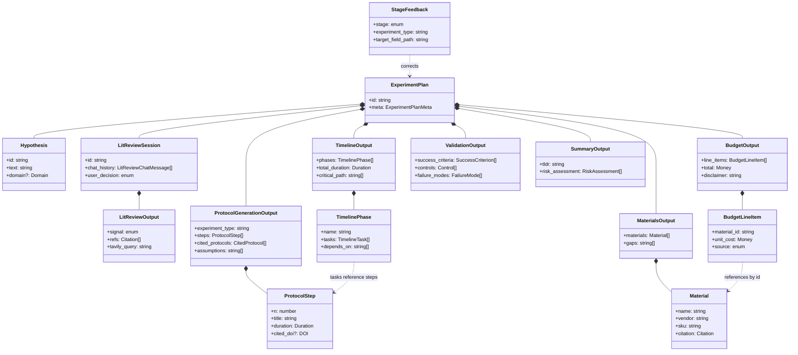

# Type Reference

Data contracts for the AI Scientist Assistant pipeline. Source of truth for what each stage consumes and emits. Mirrors the TypeScript files in `spec/types/`.

## Contents

1. [Stages at a glance](#stages-at-a-glance)
2. [Type composition diagram](#type-composition-diagram)
3. [Pipeline flow](#pipeline-flow)
4. [Conventions](#conventions)
5. [Shared types](#shared-types)
6. [Stage 1 — Lit Review](#stage-1--lit-review)
7. [Stage 2 — Protocol Generation](#stage-2--protocol-generation)
8. [Stage 3 — Materials & Supply Chain](#stage-3--materials--supply-chain)
9. [Stage 4 — Budget](#stage-4--budget)
10. [Stage 5 — Timeline](#stage-5--timeline)
11. [Stage 6 — Validation](#stage-6--validation)
12. [Stage 7 — Summary & Final Plan](#stage-7--summary--final-plan)
13. [Stretch — Feedback Loop](#stretch--feedback-loop)
14. [Storage layer (Supabase)](#storage-layer-supabase)

---

## Stages at a glance

One-screen overview. Every stage column has the same six categories so you can scan across.

| | **1. Lit Review** | **2. Protocol** | **3. Materials** | **4. Budget** | **5. Timeline** | **6. Validation** | **7. Summary** |
|---|---|---|---|---|---|---|---|
| **Input** | `Hypothesis` | `Hypothesis` + cached protocols | Stage 2 out | Stage 3 out | Stage 2 out | Stage 2 out + `Hypothesis` | All above |
| **Output type** | `LitReviewSession` | `ProtocolGenerationOutput` | `MaterialsOutput` | `BudgetOutput` | `TimelineOutput` | `ValidationOutput` | `ExperimentPlan` |
| **Core content** | `signal`, `refs[]`, `chat_history[]` | `steps[]`, `experiment_type` | `materials[]`, `by_category` | `line_items[]`, `total` | `phases[]`, `critical_path` | `success_criteria[]`, `controls[]` | `tldr`, full plan |
| **External source** | Tavily | protocols.io `/steps` | protocols.io `/materials` | LLM estimate | Derived from steps | Derived from S2 | LLM synthesis |
| **Citations** | `refs[].source` | `cited_protocols[]` | per-`Material.citation` | per-line `source` | (inherited) | (inherited) | `meta.feedback_session_ids` |
| **Honesty fields** | `signal` itself | `assumptions[]` | `gaps[]` | `disclaimer`, `assumptions[]` | `assumptions[]` | `failure_modes[]` | `risk_assessment[]` |
| **User-facing UI** | Chat panel | Step-by-step view | Materials table | Cost breakdown | Gantt-style chart | Criteria + controls list | TL;DR header |
| **Feedback target** | — | yes (stretch) | yes (stretch) | yes (stretch) | yes (stretch) | yes (stretch) | — |

Pipeline ordering: Stages 3, 5, 6 run in parallel after 2. Stage 4 depends on 3. Stage 7 waits for everything.

---

## Type composition diagram

How the types compose into the final `ExperimentPlan`. Solid lines = composition (`*--`); dashed lines = reference (`..>`).



---

## Pipeline flow

Where each type is produced and consumed across the pipeline.

| Stage | Input | Output | External source |
|---|---|---|---|
| 1. Lit Review | `Hypothesis` | `LitReviewSession` (conversational) | Tavily |
| 2. Protocol | `Hypothesis` + cached protocols | `ProtocolGenerationOutput` | protocols.io steps |
| 3. Materials | Stage 2 output | `MaterialsOutput` | protocols.io materials |
| 4. Budget | Stage 3 output | `BudgetOutput` | LLM estimate |
| 5. Timeline | Stage 2 output | `TimelineOutput` | Derived from steps |
| 6. Validation | Stage 2 output + hypothesis | `ValidationOutput` | Protocol "expected results" |
| 7. Summary | All above | `ExperimentPlan` | LLM final pass |

Stages 3, 5, 6 run in parallel after 2. Stage 4 depends on 3. Stage 7 waits for everything.

---

## Conventions

- **All outputs are JSON-serializable.** No `Date` objects, no `Map`, no functions. Survives Supabase storage and LLM round-trips.
- **Citations are first-class.** Every step, material, and budget line carries a `Citation`. Lets the UI show "from DOI X" tooltips.
- **`experiment_type` is the feedback bucketing key.** Set once in Stage 2, inherited by all downstream stages. Few-shot retrieval keys off it.
- **Honesty over hallucination.** Every stage output has `gaps` / `assumptions` / `failure_modes` fields where applicable.
- **Open-ended taxonomies are strings.** `Domain`, `MaterialCategory`, `Citation.source`, currency codes — not union literals. Lets new categories appear without schema migrations.
- **Datetimes are ISO 8601 strings** (`"2026-04-25T14:30:00Z"`). Durations are ISO 8601 duration strings (`"PT2H30M"`, `"P3D"`).

---

## Shared types

Used across all stages. Lives in `spec/types/shared.ts`.

```typescript
type ISO8601 = string;        // datetime, e.g. "2026-04-25T14:30:00Z"
type DOI = string;            // e.g. "10.17504/protocols.io.baaciaaw"
type URL = string;

type Money = {
  amount: number;
  currency: string;           // ISO 4217: 'USD', 'EUR', 'JPY', 'CHF', etc.
};

// ISO 8601 duration string. Examples:
//   "PT30M"   = 30 minutes
//   "PT2H30M" = 2.5 hours
//   "P3D"     = 3 days
//   "P2W"     = 2 weeks
type Duration = string;

type Citation = {
  source: string;             // 'protocols.io' | 'tavily' | 'paper' | 'vendor' | 'llm_estimate' | ...
  confidence: 'high' | 'medium' | 'low';
  doi?: DOI;
  url?: URL;
  title?: string;
  authors?: string[];
  year?: number;
  snippet?: string;
  relevance_score?: number;   // 0–1, primarily for lit-review refs
};

type Domain = string;         // 'diagnostics' | 'gut_health' | 'cell_biology' | 'climate' | ...

type Hypothesis = {
  id: string;
  text: string;               // raw user input
  domain?: Domain;
  intervention?: string;      // LLM-extracted from text
  measurable_outcome?: string;
  control_implied?: string;
  created_at: ISO8601;
};
```

### `Citation` — field guide

| Field | Required | Purpose |
|---|---|---|
| `source` | yes | Where the cited content came from |
| `confidence` | yes | Trust level — drives UI badges |
| `doi`, `url` | optional | Identifiers when the source has them |
| `title`, `authors`, `year`, `snippet` | optional | Populated when citing a paper (Stage 1 refs) |
| `relevance_score` | optional | Lit-review scoring; ignored for material citations |

---

## Stage 1 — Lit Review

Conversational novelty check before plan generation. Searches via Tavily, lets the user interrogate results before committing.

```typescript
type LitReviewInput = {
  hypothesis: Hypothesis;
};

type LitReviewOutput = {
  signal: 'not_found' | 'similar_work_exists' | 'exact_match_found';
  signal_explanation: string;             // 1–2 sentences
  refs: Citation[];                       // 1–3 most relevant
  searched_at: ISO8601;
  tavily_query: string;                   // exact query sent to Tavily
};

type LitReviewChatMessage = {
  role: 'user' | 'assistant';
  content: string;
  cited_refs?: number[];                  // indices into LitReviewOutput.refs
  timestamp: ISO8601;
};

type LitReviewSession = {
  id: string;
  hypothesis_id: string;
  initial_result: LitReviewOutput;
  chat_history: LitReviewChatMessage[];
  cached_tavily_context: string;          // raw Tavily content; reused for follow-ups
  user_decision: 'pending' | 'proceed' | 'refine' | 'abandon';
};
```

### `signal` values

| Value | Meaning | UI affordance |
|---|---|---|
| `not_found` | No close prior work surfaced | Green badge — "novel territory" |
| `similar_work_exists` | Related but not identical | Yellow badge — show the refs |
| `exact_match_found` | This experiment appears done already | Red badge — strong "consider before proceeding" |

---

## Stage 2 — Protocol Generation

Searches protocols.io, retrieves top-K matches, synthesizes a step-by-step protocol grounded in real cited sources.

```typescript
type ProtocolStep = {
  n: number;                              // 1-indexed
  title: string;
  body_md: string;                        // Markdown body
  duration: Duration;                     // ISO 8601, e.g. "PT45M"
  equipment_needed: string[];
  reagents_referenced: string[];          // names matching Stage 3 materials
  notes?: string;
  cited_doi?: DOI;                        // which source protocol this step drew from
};

type CitedProtocol = {
  doi: DOI;
  title: string;
  contribution_weight: number;            // 0–1, how much it shaped the methodology
};

type ProtocolGenerationOutput = {
  experiment_type: string;                // e.g. "cryopreservation", "ELISA-replacement"
  domain: Domain;
  steps: ProtocolStep[];
  cited_protocols: CitedProtocol[];
  assumptions: string[];                  // e.g. "lab has BSL-2 hood"
  total_steps: number;
};
```

`experiment_type` is set once here and inherited downstream — it's the feedback bucketing key.

---

## Stage 3 — Materials & Supply Chain

Pulls structured materials data from protocols.io's materials endpoint, normalizes vendor/SKU.

```typescript
type MaterialCategory = string;           // 'reagent' | 'consumable' | 'equipment' | 'cell_line' | 'organism' | ...

type MaterialAlternative = {
  vendor: string;
  sku: string;
  notes?: string;
};

type Material = {
  id: string;
  name: string;
  category: MaterialCategory;
  vendor: string;
  sku: string;
  qty: number;
  unit: string;                           // 'mg', 'mL', 'each', etc.
  cited_doi?: DOI;
  alternatives?: MaterialAlternative[];
  storage?: string;                       // '-80C', 'RT', etc.
  hazard?: string;
  citation: Citation;
};

type MaterialsOutput = {
  materials: Material[];
  total_unique_items: number;
  by_category: Record<MaterialCategory, number>;
  gaps: string[];                         // items we couldn't resolve catalog # for
};
```

`gaps` matters for the demo — surface honestly when the system couldn't find a SKU rather than hallucinating one.

---

## Stage 4 — Budget

LLM estimates line-item costs from the materials list. No external pricing API — flag every estimate as such.

```typescript
type BudgetSource = 'protocols_io_listed' | 'llm_estimate' | 'recent_quote';

type BudgetLineItem = {
  material_id: string;                    // FK to Material.id
  material_name: string;
  qty: number;
  unit_cost: Money;
  total: Money;
  source: BudgetSource;
  confidence: 'high' | 'medium' | 'low';
  notes?: string;
};

type BudgetOutput = {
  line_items: BudgetLineItem[];
  subtotals_by_category: Record<MaterialCategory, Money>;
  total: Money;
  contingency_pct: number;                // recommended buffer, e.g. 15
  total_with_contingency: Money;
  disclaimer: string;                     // "estimated retail; verify before ordering"
  assumptions: string[];                  // e.g. "academic pricing", "n=3 replicates"
};
```

---

## Stage 5 — Timeline

Phased breakdown derived from step durations and dependencies.

```typescript
type TimelineTask = {
  step_n: number;                         // FK to ProtocolStep.n
  name: string;
  duration: Duration;
  hands_on_time?: Duration;               // active vs incubation/passive
  can_parallel: boolean;
};

type TimelinePhase = {
  id: string;
  name: string;                           // e.g. "Cell expansion", "Treatment", "Analysis"
  duration: Duration;
  tasks: TimelineTask[];
  depends_on: string[];                   // FK to other TimelinePhase.id
  parallel_with?: string[];
};

type TimelineOutput = {
  phases: TimelinePhase[];
  total_duration: Duration;
  critical_path: string[];                // ordered phase ids
  assumptions: string[];                  // e.g. "single technician, 8h workday, 5d/week"
  earliest_completion_date?: ISO8601;
};
```

---

## Stage 6 — Validation

Success criteria, controls, and failure modes drawn from the methodology + hypothesis.

```typescript
type SuccessCriterion = {
  id: string;
  criterion: string;                      // e.g. "≥30% reduction in FITC-dextran flux"
  measurement_method: string;             // e.g. "FITC-dextran assay, 4kDa, 4h"
  threshold: string;                      // e.g. "p < 0.05, n=8 per group"
  statistical_test?: string;              // e.g. "Student's t-test"
  expected_value?: string;
};

type FailureMode = {
  mode: string;                           // e.g. "no effect observed"
  likely_cause: string;
  mitigation: string;
};

type Control = {
  name: string;
  type: 'positive' | 'negative' | 'vehicle' | 'sham';
  purpose: string;
};

type ValidationOutput = {
  success_criteria: SuccessCriterion[];
  controls: Control[];
  failure_modes: FailureMode[];
  expected_outcome_summary: string;
  go_no_go_threshold: string;             // single sentence: when to abandon
};
```

---

## Stage 7 — Summary & Final Plan

Top-level container; what gets stored and what the UI consumes for the final view.

```typescript
type RiskAssessment = {
  risk: string;
  likelihood: 'low' | 'medium' | 'high';
  impact: 'low' | 'medium' | 'high';
};

type SummaryOutput = {
  tldr: string;                           // 2–3 sentence elevator pitch
  key_decisions: string[];                // e.g. "Chose trehalose over glycerol because..."
  risk_assessment: RiskAssessment[];
  novelty_position: string;               // 1 sentence on where this sits vs prior work
};

type ExperimentPlanMeta = {
  generated_at: ISO8601;
  model_id: string;                       // 'google/gemini-2.5-flash'
  pipeline_version: string;               // 'v0.1.0'
  feedback_applied: boolean;              // were few-shot corrections used
  feedback_session_ids?: string[];
};

type ExperimentPlan = {
  id: string;
  hypothesis: Hypothesis;
  lit_review: LitReviewSession;
  protocol: ProtocolGenerationOutput;
  materials: MaterialsOutput;
  budget: BudgetOutput;
  timeline: TimelineOutput;
  validation: ValidationOutput;
  summary: SummaryOutput;
  meta: ExperimentPlanMeta;
};
```

### Example shape (truncated)

```json
{
  "id": "plan_01HXYZ...",
  "hypothesis": {
    "id": "hyp_01HABC...",
    "text": "Replacing sucrose with trehalose as a cryoprotectant...",
    "domain": "cell_biology",
    "intervention": "trehalose substitution",
    "measurable_outcome": "≥15pp post-thaw viability gain",
    "control_implied": "DMSO standard protocol",
    "created_at": "2026-04-25T14:30:00Z"
  },
  "protocol": {
    "experiment_type": "cryopreservation",
    "domain": "cell_biology",
    "steps": [
      {
        "n": 1,
        "title": "Prepare freezing medium",
        "body_md": "Combine 0.5M trehalose...",
        "duration": "PT30M",
        "equipment_needed": ["sterile hood", "centrifuge"],
        "reagents_referenced": ["trehalose", "RPMI-1640"],
        "cited_doi": "10.17504/protocols.io.baaciaaw"
      }
    ],
    "cited_protocols": [
      { "doi": "10.17504/protocols.io.baaciaaw", "title": "...", "contribution_weight": 0.8 }
    ],
    "assumptions": ["lab has access to controlled-rate freezer"],
    "total_steps": 6
  },
  "budget": {
    "line_items": [
      {
        "material_id": "mat_01",
        "material_name": "Trehalose dihydrate",
        "qty": 25,
        "unit_cost": { "amount": 89.50, "currency": "USD" },
        "total": { "amount": 89.50, "currency": "USD" },
        "source": "llm_estimate",
        "confidence": "medium"
      }
    ],
    "total": { "amount": 1247.30, "currency": "USD" },
    "contingency_pct": 15,
    "total_with_contingency": { "amount": 1434.40, "currency": "USD" },
    "disclaimer": "Estimated retail prices; verify before ordering."
  },
  "meta": {
    "generated_at": "2026-04-25T14:31:42Z",
    "model_id": "google/gemini-2.5-flash",
    "pipeline_version": "v0.1.0",
    "feedback_applied": false
  }
}
```

---

## Stretch — Feedback Loop

Captures scientist corrections, tagged for retrieval as few-shot examples on future plans of the same `experiment_type`.

```typescript
type FeedbackStage =
  | 'protocol'
  | 'materials'
  | 'budget'
  | 'timeline'
  | 'validation';

type StageFeedback = {
  id: string;
  plan_id: string;
  stage: FeedbackStage;
  experiment_type: string;                // for retrieval bucketing
  domain: Domain;
  target_field_path: string;              // JSON-pointer-like, e.g. "/steps/3/duration"
  original_value: unknown;
  corrected_value: unknown;
  rationale: string;                      // scientist's note
  reviewer_id?: string;
  applied_in_future: number;              // count of times used as few-shot
  created_at: ISO8601;
};
```

`target_field_path` uses JSON Pointer syntax — `/steps/3/duration` means "the `duration` field of the 4th item in `steps`." Lets the UI render targeted correction widgets and the few-shot retriever locate exactly what was changed.

---

## Storage layer (Supabase)

Persisted rows. Different shape from API contracts — these are what's in Postgres.

```typescript
// table: protocols_cache
type ProtocolCacheRow = {
  doi: DOI;                               // PK
  protocol_io_id: number;
  title: string;
  authors_json: string;                   // JSON-encoded
  raw_steps_json: string;                 // protocols.io /steps response
  raw_materials_json: string;             // protocols.io /materials response
  fetched_at: ISO8601;
};

// table: protocol_chunks (vectorized for retrieval)
type ProtocolChunkRow = {
  id: string;                             // PK
  doi: DOI;                               // FK to protocols_cache
  chunk_type: 'step' | 'materials' | 'abstract';
  step_n?: number;
  text: string;
  embedding: number[];                    // pgvector column, dim=768 or 1536
  metadata_json: string;
};
```

### Other Supabase tables (suggested)

| Table | PK | Purpose |
|---|---|---|
| `hypotheses` | `id` | One row per `Hypothesis` submitted |
| `lit_review_sessions` | `id` | One row per `LitReviewSession`; chat history JSON |
| `experiment_plans` | `id` | One row per `ExperimentPlan` (composite stored as JSONB) |
| `feedback` | `id` | One row per `StageFeedback`; queryable by `experiment_type` |
| `protocols_cache` | `doi` | Raw protocols.io responses |
| `protocol_chunks` | `id` | pgvector-indexed chunks for RAG |

---

## File map

```
spec/
├── architecture.md           ← high-level architecture + Mermaid diagram
├── TYPES.md                  ← this file
└── types/
    ├── index.ts              ← re-exports everything
    ├── shared.ts             ← ISO8601, DOI, Money, Duration, Citation, Hypothesis
    ├── lit-review.ts         ← Stage 1
    ├── protocol.ts           ← Stage 2
    ├── materials.ts          ← Stage 3
    ├── budget.ts             ← Stage 4
    ├── timeline.ts           ← Stage 5
    ├── validation.ts         ← Stage 6
    ├── summary.ts            ← Stage 7 + ExperimentPlan
    ├── feedback.ts           ← Stretch goal
    └── storage.ts            ← Supabase row shapes
```
