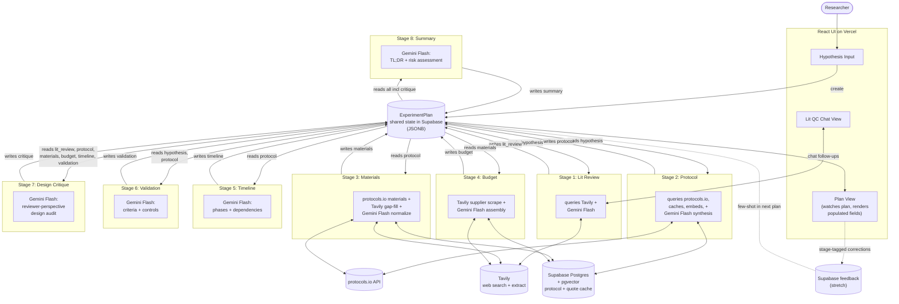

> **Tentative — first-pass data architecture proposal.** Drafted so the team has something concrete to align on. Specifics will likely change as others weigh in.

# AI Scientist Assistant — Architecture

## Stack

| Layer | Tool | Notes |
|---|---|---|
| Dev environment | Cursor | Hackathon credit (claimed) |
| UI scaffold | Lovable | Initial scaffold only; export to GitHub, continue in Cursor |
| Frontend framework | React | Generated by Lovable, owned by team |
| Deployment | Vercel | Hackathon credit (claimed) |
| Backend / DB / serverless | Supabase | Free tier; Postgres + pgvector + edge functions |
| Stage 1 lit search | Europe PMC | Free, no auth. Biomedical-specific. **Implementation note:** original spec called for Tavily here, but Tavily snippets didn't reliably surface bibliographic metadata, so we swapped to Europe PMC (which returns structured authors/year/venue/abstract/DOI). |
| Web search + extract | Tavily | Stages 3 (catalog gap-fill) and 4 (supplier pricing). Hackathon credit `TVLY-HF9ETJRW`. |
| LLM (prototyping) | OpenRouter → `google/gemini-2.5-flash` | Default for dev iteration: cheap, fast, swap models freely via one gateway |
| LLM (production) | Anthropic direct → Claude Sonnet 4.6 | Higher quality and reliability for the demo/production runs; uses Anthropic SDK directly with prompt caching |
| Protocol data source | protocols.io REST API | Source of truth for protocol content |
| Supplier sources | Thermo Fisher, Sigma-Aldrich, Promega, Qiagen, IDT, ATCC, Addgene | Crawled via Tavily for catalog #s + pricing |
| Embeddings | OpenAI `text-embedding-3-small` or local | Cheap or free |

## Pipeline (blackboard pattern)

8 stages, all reading from and writing to one shared `ExperimentPlan` document stored in Supabase. No stage-to-stage handoffs — every stage's data dependency is on fields of the shared plan. The orchestrator schedules a stage when its `reads` are populated and the stage isn't already running or complete.

This makes the system:
- **Resumable** — failed stages don't block independent stages
- **Observable** — full plan state is one inspectable JSON document at any point
- **Extensible** — adding a stage means declaring its `reads`/`writes`, no plumbing
- **Naturally progressive** — UI watches the plan; populated fields render, missing fields show "generating…"



### Stage contracts (declarative orchestration)

`spec/types/stage-contracts.ts` defines `STAGE_CONTRACTS` — the runtime read/write declarations the orchestrator uses. Summary:

| Stage | Reads | Writes | Parallel-safe |
|---|---|---|---|
| 1. Lit Review | `hypothesis` | `lit_review` | yes |
| 2. Protocol | `hypothesis` | `protocol` | yes |
| 3. Materials | `protocol` | `materials` | yes |
| 5. Timeline | `protocol` | `timeline` | yes |
| 6. Validation | `hypothesis`, `protocol` | `validation` | yes |
| 4. Budget | `materials` | `budget` | yes |
| 7. Design Critique | `hypothesis`, `lit_review`, `protocol`, `materials`, `budget`, `timeline`, `validation` | `critique` | yes |
| 8. Summary | all 8 stage fields | `summary` | no (last) |

Stages 1 and 2 can start immediately. 3, 5, 6 unlock when 2 completes. 4 unlocks when 3 completes. 7 unlocks when 1, 3, 4, 5, 6 are all complete (lit_review is a read dependency for novelty evaluation). 8 waits for everything including critique.

## Stage data shapes

Full TypeScript interfaces in `spec/types/`. Each stage writes its named field on `ExperimentPlan`:

| Plan field | Type | Written by | External source |
|---|---|---|---|
| `lit_review` | `LitReviewSession` (conversational) | Stage 1 | Europe PMC (was Tavily in original spec; see note in stack table) |
| `protocol` | `ProtocolGenerationOutput` | Stage 2 | protocols.io steps |
| `materials` | `MaterialsOutput` | Stage 3 | protocols.io materials + Tavily for gaps |
| `budget` | `BudgetOutput` | Stage 4 | Tavily supplier-page scrape + LLM estimate fallback |
| `timeline` | `TimelineOutput` | Stage 5 | derived from steps |
| `validation` | `ValidationOutput` | Stage 6 | protocol "expected results" |
| `critique` | `DesignCritique` | Stage 7 | LLM reviewer-perspective audit over Stages 2–6 |
| `summary` | `SummaryOutput` | Stage 8 | LLM final pass over all other fields |

### Supplier domains (queried via Tavily in Stages 3 & 4)

| Vendor key | Domain | Use |
|---|---|---|
| `thermo_fisher` | thermofisher.com | General reagents, kits, instruments |
| `sigma_aldrich` | sigmaaldrich.com (Merck) | Chemicals, biochemicals |
| `promega` | promega.com | Molecular biology kits |
| `qiagen` | qiagen.com | Sample prep, extraction kits |
| `idt` | idtdna.com | Oligos, primers, gBlocks |
| `atcc` | atcc.org | Cell lines, organisms |
| `addgene` | addgene.org | Plasmids, viral preps |

## Design principles

- **Blackboard, not pipeline.** Stages don't pass data to each other; they read and write fields on a shared `ExperimentPlan`. Adding a stage = declaring `reads`/`writes`. Re-running a stage = overwriting its field.
- **Citations are first-class.** Every step, material, supplier quote, and budget line carries a `Citation` or `SupplierQuote` with source URL. Demo signal: tooltip "from DOI X" or "from Sigma product page (scraped 2026-04-25)."
- **`experiment_type` is the feedback bucketing key.** Set once when Stage 2 writes `protocol.experiment_type`; inherited downstream. Few-shot retrieval keys off it.
- **Honest gaps over hallucination.** Every stage output has `gaps` / `assumptions` / `failure_modes` fields — explicitly surface what the system couldn't resolve. A budget line marked `source: 'llm_estimate'` is honest; a fabricated SKU is not.
- **Cache every external fetch into Supabase.** protocols.io responses, Tavily search/extract results, supplier quotes, embeddings, and any other paid-or-rate-limited call gets cached by a deterministic key (URL, query hash, content hash) with a TTL appropriate to the data type — protocols rarely change (long TTL); supplier prices change (short TTL); embeddings are immutable per text. The cache is shared across all plans so retries and re-runs are nearly free.
- **Each stage is independently testable.** Mock the plan with the stage's `reads` populated, run that stage in isolation. Important for parallel hackathon work.
- **Progressive UI rendering.** UI subscribes to the plan document. Each populated field renders its section; missing fields show "generating…". No coordinated loading state.

## LLM provider strategy

Two LLM client codepaths, used for different lifecycle stages:

| Mode | Provider | Default model | When |
|---|---|---|---|
| **Prototyping** | OpenRouter (OpenAI-compatible API) | `google/gemini-2.5-flash` | Day-to-day dev iteration. Cheap (~$0.30 per million output tokens), fast, lets us A/B different models on the same prompts without juggling SDKs. |
| **Production** | Anthropic SDK (direct) | `claude-sonnet-4-6` | Demo runs and any user-visible output where quality matters. No OpenRouter markup, supports Anthropic's prompt caching for the protocols.io context we re-use across stages. |

**Why both:** prototyping on OpenRouter keeps dev cycles cheap and gives us model-swap flexibility while we tune prompts. Switching to Anthropic for production trades that flexibility for higher-quality, more consistent Claude output and prompt caching savings on the long retrieved-protocol context that shows up in Stages 2/3.

**Implementation detail:** the two SDKs have different message formats (Claude separates system prompt + uses content blocks; OpenAI-compatible flattens them). The runtime LLM client abstracts this — stages call `llm.complete({ system, user, ... })` and the client picks the codepath based on `LLM_PROVIDER=openrouter|anthropic` env var. Prompt content is identical between modes; only the wire format differs.

Switch via `.env`:
```
LLM_PROVIDER=openrouter   # default for dev
# LLM_PROVIDER=anthropic  # uncomment for production runs
```

## Tavily call budget per plan

Rough estimate to size credit usage:

| Stage | Calls | Notes |
|---|---|---|
| 1 (Lit QC) | 1 + ~3 follow-ups | Initial search + cached context for chat |
| 3 (Materials gap fill) | 0–3 | Only when protocols.io has vague material |
| 4 (Budget pricing) | 5–10 | Per material above a cost-relevance threshold |
| **Total** | **~9–17 per plan** | Cache hits reduce subsequent runs significantly |

Stages 2, 5, 6, 7, and 8 don't hit Tavily — they're LLM-only synthesis over data already in the plan.

## Tavily call shapes per stage

Recommended request parameters per stage. The Tavily client wrapper should expose stage-specific helpers (e.g., `tavilyForLitReview(query)`, `tavilyForSupplier(vendor, sku)`) that bake these defaults so individual stage code stays uncluttered.

### Stage 1 — Lit Review

```typescript
tavily.search({
  query: rephrasedHypothesis,        // LLM-rewritten from the raw user hypothesis
  search_depth: "advanced",          // 2 credits; worth it for novelty quality
  max_results: 5,
  include_answer: true,              // synthesized answer for the novelty signal
  include_raw_content: false,        // snippets are enough; keeps token cost down
  // intentionally NO `days` — return the most relevant prior work
  // regardless of age. Foundational papers from 2003 should surface
  // if they invalidate the novelty claim.
})
```

### Stage 1 chat follow-ups

The conversational layer **doesn't fire fresh Tavily calls per turn**. The initial search result + raw content is cached on the `LitReviewSession` (`cached_tavily_context`), and follow-up questions are answered by the LLM over that cached context. New Tavily calls only fire if the user materially changes the search topic or explicitly asks for "more papers."

### Stage 3 — Materials gap-fill

```typescript
tavily.search({
  query: `${reagentName} catalog number`,
  include_domains: [
    "sigmaaldrich.com", "thermofisher.com", "promega.com",
    "qiagen.com", "idtdna.com", "atcc.org", "addgene.org",
  ],
  search_depth: "basic",             // 1 credit; finding a product page doesn't need depth
  max_results: 3,
  include_answer: false,             // we want the URL, not a synthesis
  include_raw_content: false,
  // no `days` — supplier pages are evergreen URLs, not time-sensitive
})
```

Only fires when a `Material` from protocols.io is missing `vendor` or `sku`. Skip otherwise.

### Stage 4 — Budget pricing

```typescript
tavily.search({
  query: `${vendor} ${sku} price`,
  include_domains: [vendorDomain],   // narrow to the chosen vendor's domain only
  search_depth: "basic",
  max_results: 1,                    // top hit is almost always the product page
  include_answer: false,
  include_raw_content: true,         // need full page text to extract the price
  // no `days`
})
```

Only fire for materials above a cost-relevance threshold (e.g., expected unit cost > $50 or `category == 'cell_line'/'organism'/'equipment'`). Cheap consumables get LLM-estimated prices to avoid burning credits on $5 tubes.

### Cache key conventions

Every Tavily response is cached by SHA-256 of the canonicalized request body (sorted JSON of `{query, search_depth, max_results, include_answer, include_raw_content, include_domains, days}`). TTLs:

| Stage | TTL | Reason |
|---|---|---|
| Lit Review | 7 days | Prior-art landscape changes slowly |
| Materials gap-fill | 30 days | Catalog # rarely changes |
| Budget pricing | 24 hours | Supplier prices can change weekly |

Cache misses fall through to live Tavily; hits return cached JSON unmodified.

## Scope

**This product is limited to bioscience.** Biomedical and life-sciences experiments only — cell biology, molecular biology, diagnostics, microbiology / gut health, immunology, neuroscience, plant science, ecology, etc. Domains outside biology (climate, materials science, pure chemistry, energy) are explicitly out of scope. The challenge brief's fourth sample (Sporomusa CO₂ fixation) is a climate application and is excluded from our test set even though it uses a microbe.

This scope shapes prompt design, retrieval sources (protocols.io is bioscience-heavy already), and the supplier list (Sigma / Thermo / Promega / Qiagen / IDT / ATCC / Addgene are all bioscience suppliers).

## Sample inputs (in-scope subset of challenge brief)

Test set for end-to-end runs:

1. **Diagnostics** — paper-based electrochemical biosensor for CRP detection
2. **Gut Health** — L. rhamnosus GG in C57BL/6 mice, FITC-dextran assay
3. **Cell Biology** — trehalose vs DMSO cryopreservation of HeLa

Any plan output should handle all three. The brief's fourth sample (Climate / Sporomusa) is excluded as out of scope.
