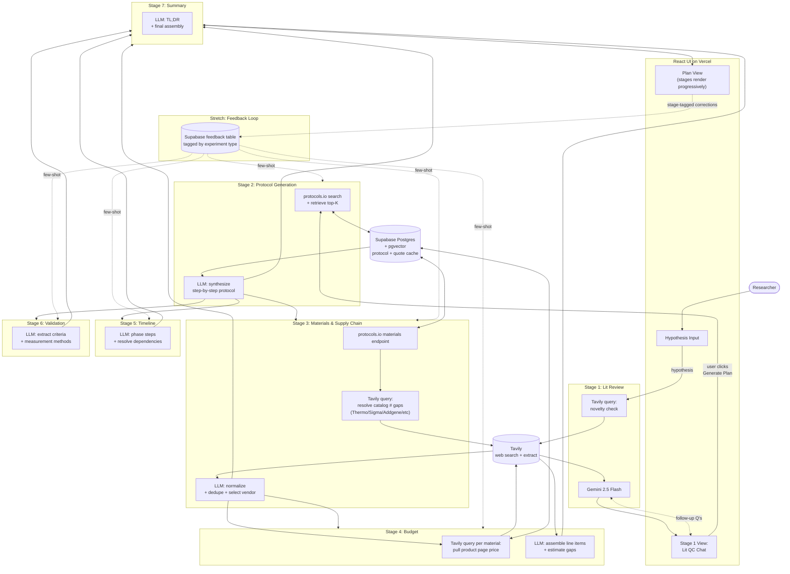

# AI Scientist Assistant — Architecture

## Stack

| Layer | Tool | Notes |
|---|---|---|
| Dev environment | Cursor | Hackathon credit (claimed) |
| UI scaffold | Lovable | Initial scaffold only; export to GitHub, continue in Cursor |
| Frontend framework | React | Generated by Lovable, owned by team |
| Deployment | Vercel | Hackathon credit (claimed) |
| Backend / DB / serverless | Supabase | Free tier; Postgres + pgvector + edge functions |
| Web search + extract | Tavily | Stages 1 (lit QC), 3 (catalog gap-fill), 4 (supplier pricing). Hackathon credit `TVLY-HF9ETJRW`. |
| LLM gateway | OpenRouter | Single gateway for all model calls |
| LLM model | `google/gemini-2.5-flash` | All stages |
| Protocol data source | protocols.io REST API | Source of truth for protocol content |
| Supplier sources | Thermo Fisher, Sigma-Aldrich, Promega, Qiagen, IDT, ATCC, Addgene | Crawled via Tavily for catalog #s + pricing |
| Embeddings | OpenAI `text-embedding-3-small` or local | Cheap or free |

## Pipeline

7 stages. Stage 1 is conversational (user-facing chat). Stages 2–7 are the plan generation pipeline; 3/5/6 run in parallel after 2; 4 waits for 3; 7 waits for everything.

## Stage contracts

Full TypeScript interfaces in `spec/types/`. Summary:

| Stage | Input | Output | Source |
|---|---|---|---|
| 1. Lit Review | `Hypothesis` | `LitReviewSession` (conversational) | Tavily |
| 2. Protocol | `Hypothesis` + cached protocols | `ProtocolGenerationOutput` | protocols.io steps |
| 3. Materials | Stage 2 output | `MaterialsOutput` | protocols.io materials + Tavily for gaps |
| 4. Budget | Stage 3 output | `BudgetOutput` | Tavily supplier-page scrape + LLM estimate fallback |
| 5. Timeline | Stage 2 output | `TimelineOutput` | derived from steps |
| 6. Validation | Stage 2 output + hypothesis | `ValidationOutput` | protocol "expected results" |
| 7. Summary | All above | `ExperimentPlan` | LLM final pass |

### Supplier domains (queried via Tavily in Stages 3 & 4)

| Vendor key | Domain | Use |
|---|---|---|
| `thermo_fisher` | thermofisher.com | General reagents, kits, instruments |
| `sigma_aldrich` | sigmaaldrich.com (Merck) | Chemicals, biochemicals |
| `promega` | promega.com | Molecular biology kits |
| `qiagen` | qiagen.com | Sample prep, extraction kits |
| `idt` | idtdna.com | Oligos, primers, gBlocks |
| `atcc` | atcc.org | Cell lines, organisms |
| `addgene` | addgene.org | Plasmids, viral preps |

## Design principles

- **Citations are first-class.** Every step, material, supplier quote, and budget line carries a `Citation` or `SupplierQuote` with source URL. Demo signal: tooltip "from DOI X" or "from Sigma product page (scraped 2026-04-25)."
- **`experiment_type` is the feedback bucketing key.** Set once in Stage 2; inherited by all stages. Few-shot retrieval keys off it.
- **Honest gaps over hallucination.** Every stage output has `gaps` / `assumptions` / `failure_modes` fields — explicitly surface what the system couldn't resolve. A budget line marked `source: 'llm_estimate'` is honest; a fabricated SKU is not.
- **Tavily caches into Supabase aggressively.** Every supplier quote and Tavily extraction is cached by URL. Re-running a similar plan reuses prior quotes within a TTL (e.g., 7 days).
- **Each stage is independently testable.** Mock upstream output, run any stage in isolation. Important for parallel hackathon work.
- **Progressive UI rendering.** Stages stream to the UI as they complete; user sees plan assemble in real time, not a 30s loading spinner.

## Tavily call budget per plan

Rough estimate to size credit usage:

| Stage | Calls | Notes |
|---|---|---|
| 1 (Lit QC) | 1 + ~3 follow-ups | Initial search + cached context for chat |
| 3 (Materials gap fill) | 0–3 | Only when protocols.io has vague material |
| 4 (Budget pricing) | 5–10 | Per material above a cost-relevance threshold |
| **Total** | **~9–17 per plan** | Cache hits reduce subsequent runs significantly |

## Sample inputs (from challenge brief)

Test set for end-to-end runs:

1. **Diagnostics** — paper-based electrochemical biosensor for CRP detection
2. **Gut Health** — L. rhamnosus GG in C57BL/6 mice, FITC-dextran assay
3. **Cell Biology** — trehalose vs DMSO cryopreservation of HeLa
4. **Climate** — Sporomusa ovata bioelectrochemical CO₂ fixation

Any plan output should handle all four.
