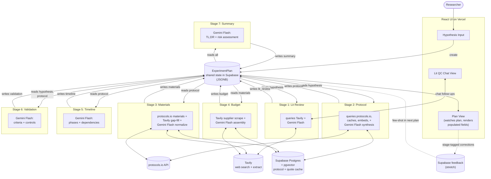

> **Tentative — first-pass data architecture proposal.** Drafted so the team has something concrete to align on. Specifics will likely change as others weigh in.

# AI Scientist Assistant — Architecture

## Stack

| Layer | Tool | Notes |
|---|---|---|
| Dev environment | Cursor | Hackathon credit (claimed) |
| UI scaffold | Lovable | Initial scaffold only; export to GitHub, continue in Cursor |
| Frontend framework | React | Generated by Lovable, owned by team |
| Deployment | Vercel | Hackathon credit (claimed) |
| Backend / DB / serverless | Supabase | Free tier; Postgres + pgvector + edge functions |
| Web search + extract | Tavily | Stages 1 (lit QC), 3 (catalog gap-fill), 4 (supplier pricing). Hackathon credit `TVLY-HF9ETJRW`. |
| LLM gateway | OpenRouter | Single gateway for all model calls |
| LLM model | `google/gemini-2.5-flash` | All stages |
| Protocol data source | protocols.io REST API | Source of truth for protocol content |
| Supplier sources | Thermo Fisher, Sigma-Aldrich, Promega, Qiagen, IDT, ATCC, Addgene | Crawled via Tavily for catalog #s + pricing |
| Embeddings | OpenAI `text-embedding-3-small` or local | Cheap or free |

## Pipeline (blackboard pattern)

7 stages, all reading from and writing to one shared `ExperimentPlan` document stored in Supabase. No stage-to-stage handoffs — every stage's data dependency is on fields of the shared plan. The orchestrator schedules a stage when its `reads` are populated and the stage isn't already running or complete.

This makes the system:
- **Resumable** — failed stages don't block independent stages
- **Observable** — full plan state is one inspectable JSON document at any point
- **Extensible** — adding a stage means declaring its `reads`/`writes`, no plumbing
- **Naturally progressive** — UI watches the plan; populated fields render, missing fields show "generating…"

### Stage contracts (declarative orchestration)

`spec/types/stage-contracts.ts` defines `STAGE_CONTRACTS` — the runtime read/write declarations the orchestrator uses. Summary:

| Stage | Reads | Writes | Parallel-safe |
|---|---|---|---|
| 1. Lit Review | `hypothesis` | `lit_review` | yes |
| 2. Protocol | `hypothesis` | `protocol` | yes |
| 3. Materials | `protocol` | `materials` | yes |
| 5. Timeline | `protocol` | `timeline` | yes |
| 6. Validation | `hypothesis`, `protocol` | `validation` | yes |
| 4. Budget | `materials` | `budget` | yes |
| 7. Summary | all 7 stage fields | `summary` | no (last) |

Stages 1 and 2 can start immediately. 3, 5, 6 unlock when 2 completes. 4 unlocks when 3 completes. 7 waits for everything.

## Stage data shapes

Full TypeScript interfaces in `spec/types/`. Each stage writes its named field on `ExperimentPlan`:

| Plan field | Type | Written by | External source |
|---|---|---|---|
| `lit_review` | `LitReviewSession` (conversational) | Stage 1 | Tavily |
| `protocol` | `ProtocolGenerationOutput` | Stage 2 | protocols.io steps |
| `materials` | `MaterialsOutput` | Stage 3 | protocols.io materials + Tavily for gaps |
| `budget` | `BudgetOutput` | Stage 4 | Tavily supplier-page scrape + LLM estimate fallback |
| `timeline` | `TimelineOutput` | Stage 5 | derived from steps |
| `validation` | `ValidationOutput` | Stage 6 | protocol "expected results" |
| `summary` | `SummaryOutput` | Stage 7 | LLM final pass over all other fields |

### Supplier domains (queried via Tavily in Stages 3 & 4)

| Vendor key | Domain | Use |
|---|---|---|
| `thermo_fisher` | thermofisher.com | General reagents, kits, instruments |
| `sigma_aldrich` | sigmaaldrich.com (Merck) | Chemicals, biochemicals |
| `promega` | promega.com | Molecular biology kits |
| `qiagen` | qiagen.com | Sample prep, extraction kits |
| `idt` | idtdna.com | Oligos, primers, gBlocks |
| `atcc` | atcc.org | Cell lines, organisms |
| `addgene` | addgene.org | Plasmids, viral preps |

## Design principles

- **Blackboard, not pipeline.** Stages don't pass data to each other; they read and write fields on a shared `ExperimentPlan`. Adding a stage = declaring `reads`/`writes`. Re-running a stage = overwriting its field.
- **Citations are first-class.** Every step, material, supplier quote, and budget line carries a `Citation` or `SupplierQuote` with source URL. Demo signal: tooltip "from DOI X" or "from Sigma product page (scraped 2026-04-25)."
- **`experiment_type` is the feedback bucketing key.** Set once when Stage 2 writes `protocol.experiment_type`; inherited downstream. Few-shot retrieval keys off it.
- **Honest gaps over hallucination.** Every stage output has `gaps` / `assumptions` / `failure_modes` fields — explicitly surface what the system couldn't resolve. A budget line marked `source: 'llm_estimate'` is honest; a fabricated SKU is not.
- **Tavily caches into Supabase aggressively.** Every supplier quote and Tavily extraction is cached by URL. Re-running a similar plan reuses prior quotes within a TTL (e.g., 7 days).
- **Each stage is independently testable.** Mock the plan with the stage's `reads` populated, run that stage in isolation. Important for parallel hackathon work.
- **Progressive UI rendering.** UI subscribes to the plan document. Each populated field renders its section; missing fields show "generating…". No coordinated loading state.

## Tavily call budget per plan

Rough estimate to size credit usage:

| Stage | Calls | Notes |
|---|---|---|
| 1 (Lit QC) | 1 + ~3 follow-ups | Initial search + cached context for chat |
| 3 (Materials gap fill) | 0–3 | Only when protocols.io has vague material |
| 4 (Budget pricing) | 5–10 | Per material above a cost-relevance threshold |
| **Total** | **~9–17 per plan** | Cache hits reduce subsequent runs significantly |

## Sample inputs (from challenge brief)

Test set for end-to-end runs:

1. **Diagnostics** — paper-based electrochemical biosensor for CRP detection
2. **Gut Health** — L. rhamnosus GG in C57BL/6 mice, FITC-dextran assay
3. **Cell Biology** — trehalose vs DMSO cryopreservation of HeLa
4. **Climate** — Sporomusa ovata bioelectrochemical CO₂ fixation

Any plan output should handle all four.
