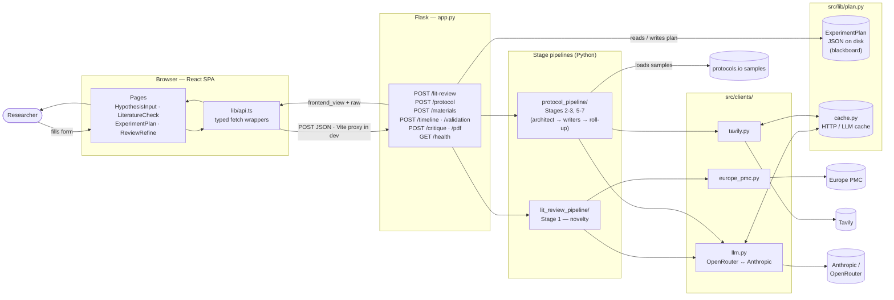

# Technical Details

A complement to [`README.md`](README.md) and [`spec/architecture.md`](spec/architecture.md). The README covers what the system does; the architecture spec covers the blackboard pattern and stage contracts. **This file covers the on-disk layout and where a request actually goes.**

## Request lifecycle



The plan store is the only piece of shared state between stages. Every endpoint reads the relevant plan fields, runs its stage, writes results back, and returns a response to the FE. See [`spec/architecture.md`](spec/architecture.md) for the full blackboard model and per-stage data contracts.

## Project structure

```
AI_Scientist_Assistant/
├── README.md                         Project overview · how to run
├── HOWTO.md                          Workflows & dev recipes
├── technical_details.md              ← this file
│
├── app.py                            Flask API · entry point for the FE
├── api.py                            Older API surface (legacy)
├── main.py                           CLI driver (legacy)
├── claude_client.py                  Direct Anthropic client (legacy planner)
├── planner.py                        Legacy single-shot prompt path
├── prompts.py                        Prompt templates
├── feedback_store.py                 Persists user feedback for few-shot
├── run_lr.py                         CLI: run Stage 1 against a YAML input
├── run_protocol.py                   CLI: run Stages 2-3 against a YAML input
├── requirements.txt                  Python deps
├── output.json                       Last CLI run dump (gitignored in real use)
│
├── inputs/                           YAML hypothesis fixtures
│   ├── crp.yaml
│   ├── lactobacillus.yaml
│   └── trehalose.yaml
│
├── lit_review_pipeline/              Stage 1 — novelty check
│   ├── stage.py                      Orchestrator: runs the stage end-to-end
│   ├── extractors.py                 Pulls citations out of search results
│   ├── europe_pmc_smoke.py           Smoke test for the Europe PMC client
│   └── tavily_smoke.py               Smoke test for the Tavily client
│
├── protocol_pipeline/                Stages 2-3, 5-7 (multi-agent)
│   ├── stage.py                      Orchestrator
│   ├── sources.py                    Loads protocols.io sample JSONs
│   ├── relevance.py                  Drops obviously off-target sources
│   ├── architect.py                  Emits the procedure outline (1 LLM call)
│   ├── writer.py                     One LLM call per procedure (parallel)
│   ├── materials.py                  Roll-up: dedup equipment + reagents
│   ├── timeline.py                   Stage 5 — deterministic phase compute
│   ├── validation.py                 Stage 6 — criteria + failure modes
│   ├── critique.py                   Stage 7 — reviewer-perspective audit
│   ├── pdf.py                        Renders a printable protocol PDF
│   └── frontend_view.py              Adapts rich Pydantic models → FE shape
│
├── src/                              Shared library code
│   ├── types.py                      Pydantic models (ExperimentPlan, …)
│   ├── cli.py
│   ├── clients/
│   │   ├── llm.py                    OpenRouter ↔ Anthropic abstraction
│   │   ├── europe_pmc.py             Stage-1 literature search
│   │   └── tavily.py                 Web-search + extract for Stages 3, 4
│   └── lib/
│       ├── plan.py                   Plan persistence (the blackboard)
│       └── cache.py                  HTTP / LLM response cache
│
├── spec/                             Source-of-truth specs
│   ├── architecture.md               Stages, blackboard, mermaid diagram
│   ├── TYPES.md                      Field-level walkthrough
│   ├── schemas/                      JSON Schemas
│   └── types/                        TS type definitions
│
├── pipeline_output_samples/          Committed sample outputs per pipeline
│   ├── protocols_io/                 Static protocols.io JSONs (Stage 2 input)
│   └── protocol_pipeline/            Sample plans produced by Stage 2 runs
│
├── plans/                            Persisted plan documents (runtime)
├── tests/                            pytest suite
├── tools/                            One-off scripts
│
└── frontend/                         React SPA (Vite + TS + Tailwind)
    ├── vite.config.ts                Dev proxy → http://localhost:5000
    ├── index.html
    ├── public/
    └── src/
        ├── App.tsx                   Router root
        ├── main.tsx                  Entry
        ├── pages/
        │   ├── Welcome.tsx
        │   ├── HypothesisInput.tsx   Form → derives research_question
        │   ├── LiteratureCheck.tsx   POST /lit-review · novelty UI
        │   ├── ExperimentPlan.tsx    Chains /protocol → /materials → …
        │   ├── ReviewRefine.tsx
        │   ├── Drafts.tsx · Library.tsx · Account.tsx · Index.tsx
        │   └── NotFound.tsx
        ├── components/
        │   ├── SiteHeader.tsx · NavLink.tsx · WorkflowChart.tsx
        │   ├── AIAssistantLauncher.tsx · AIAssistantPanel.tsx
        │   └── ui/                   shadcn primitives
        ├── lib/
        │   ├── api.ts                Typed fetch wrappers · ApiException
        │   ├── hypothesis.ts         Shared structured-hypothesis helpers
        │   └── utils.ts              cn() etc.
        ├── hooks/                    use-toast, use-mobile
        ├── test/                     vitest setup
        ├── index.css · App.css
        └── tailwind.config.ts
```

## Entry points

| Entry | What it runs |
|---|---|
| `python -m flask --app app run --port 5000` | Flask API serving the FE |
| `python run_lr.py inputs/crp.yaml` | Stage 1 only, CLI |
| `python run_protocol.py inputs/crp.yaml` | Stages 2-3, CLI |
| `cd frontend && npm run dev` | Vite dev server (proxies API calls to :5000) |
| `cd frontend && npm run build` | Production bundle to `frontend/dist/` |
| `cd frontend && npm test` | vitest |
| `pytest` | Backend test suite |

## Provider switching

`LLM_PROVIDER` in `.env` selects the codepath in `src/clients/llm.py`:

- `openrouter` — `google/gemini-2.5-flash` for cheap dev iteration
- `anthropic` — `claude-sonnet-4-6` direct, with prompt caching, for demo / production

Stages call `llm.complete({ system, user, ... })` and the client picks the wire format. Prompt content is identical between modes.
